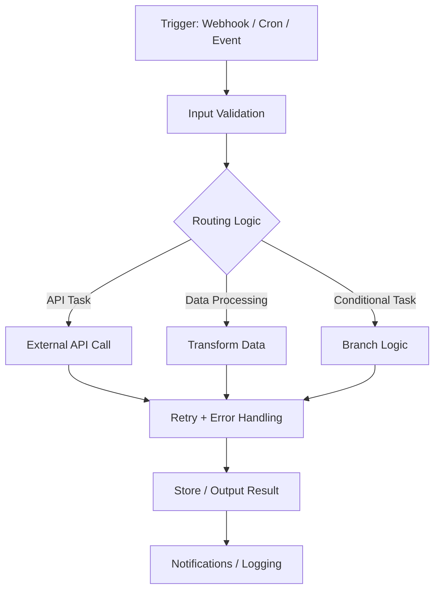

# n8n Automation Pattern Architecture

This repository documents reusable workflow patterns for building scalable automation systems with n8n.

## Core Workflow Architecture

## Key Design Principles

- Modular workflow components
- Clear branching logic
- Centralized error handling
- Reusable integration nodes
- Maintainable automation pipelines
